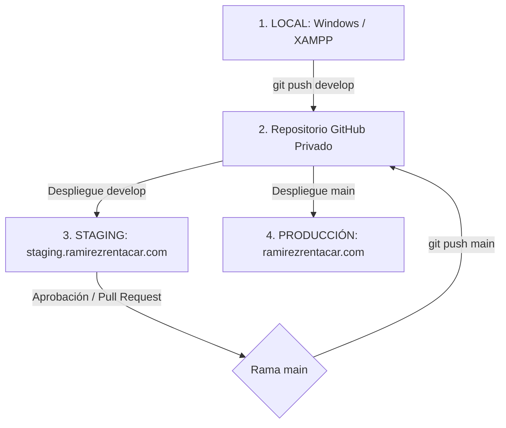

# Arquitectura de Despliegue y Git: Ramirez Rent A Car

Este documento describe el flujo de trabajo profesional para el control de versiones y el despliegue del proyecto entre los entornos de desarrollo local, pruebas (Staging) y producción, sin comprometer datos de clientes ni credenciales sensibles.

---

## 1. Topología de Entornos



1. **LOCAL**: Desarrollo en XAMPP (`http://localhost/ramirezrentacar`). Pruebas preliminares con pasarela Sandbox y túnel inverso de `ngrok` para webhooks.
2. **STAGING**: Subdominio público de pruebas (`https://staging.ramirezrentacar.com`). Pruebas E2E completas con cuentas Sandbox de PayPal reales conectadas a internet.
3. **PRODUCCIÓN**: Servidor final en vivo (`https://ramirezrentacar.com`). Conectado a la API PayPal Live.

---

## 2. Estructura del Repositorio Git
No versionaremos el núcleo (Core) de WordPress ni la carpeta de archivos multimedia subidos (`uploads`), para mantener un repositorio limpio y evitar conflictos de base de datos.

Estructura del repositorio:
```
ramirez-rentacar-wordpress/
├── plugins/
│   ├── ramirez-rent-a-car-manager/
│   ├── ramirez-paypal-booking-gateway/
│   ├── ramirez-ai-assistant/
│   └── break-the-mold-ai-translator/
├── themes/
│   └── ramirez-child/
├── docs/
│   ├── ramirez-paypal-audit.md
│   └── ramirez-deployment-architecture.md
├── .gitignore
└── README.md
```

---

## 3. `.gitignore` Recomendado
Este archivo evita la sincronización de archivos generados dinámicamente y credenciales confidenciales:

```gitignore
# WordPress Core Files (No versionar el núcleo)
/wp-admin/
/wp-includes/
/wp-*.php
/index.php
/license.txt
/readme.html
/xmlrpc.php

# Archivos de configuración y secretos (¡NUNCA subir a Git!)
wp-config.php
.env
.env.*
.cpanel.yml.private

# Carpeta de Archivos Subidos por el Cliente
/wp-content/uploads/
/wp-content/blogs.dir/

# Caché, optimizaciones y temporales
/wp-content/cache/
/wp-content/litespeed/
/wp-content/upgrade/
*.log
debug.log

# IDEs y Entornos Locales
.vscode/
.idea/
.agents
.gemini/
/operations-app/node_modules/
```

---

## 4. Estrategia de Base de Datos y Elementor
> [!CAUTION]
> **REGLA DE ORO:** Nunca sobrescriba la base de datos de Producción con la base de datos de Staging o Local.
> Esto borraría instantáneamente reservas en curso, nuevos clientes, logs de pagos completados y conversaciones de chat operativas.

- **Código y Lógica (PHP/JS/CSS)**: Viajan de Local $\rightarrow$ Staging $\rightarrow$ Producción usando Git.
- **Contenidos Visuales (Elementor)**:
  - Para páginas nuevas o plantillas de diseño, utilice la opción **Exportar/Importar Plantilla** (JSON) de Elementor.
  - Para configuraciones críticas que residen en BD (ej. enlaces a pasarelas o formularios), configúrelas manualmente por única vez en cada entorno.
- **Reservas y Transacciones**: Producción es el único origen de la verdad (*Source of Truth*). La base de datos local y de staging solo deben contener datos semilla (*Seeders*) o copias anonimizadas de registros históricos para fines de prueba.

---

## 5. Automatización de Despliegue en cPanel

### Opción A: Git Version Control (cPanel Nativo)
Si el hosting dispone de **Git Version Control**, se configurará un archivo `.cpanel.yml` en la raíz del repositorio de cPanel para copiar los plugins y el tema hijo a las rutas del servidor web al completarse un deploy:

```yaml
---
deployment:
  tasks:
    - export DEPLOYPATH=/home/TU_USUARIO/public_html/
    - /bin/cp -R plugins/ramirez-rent-a-car-manager $DEPLOYPATH/wp-content/plugins/
    - /bin/cp -R plugins/ramirez-paypal-booking-gateway $DEPLOYPATH/wp-content/plugins/
    - /bin/cp -R plugins/ramirez-ai-assistant $DEPLOYPATH/wp-content/plugins/
    - /bin/cp -R plugins/break-the-mold-ai-translator $DEPLOYPATH/wp-content/plugins/
```

### Opción B: GitHub Actions (CI/CD Automatizado por SSH)
Se puede configurar un flujo de trabajo de GitHub Action (`.github/workflows/deploy.yml`) para que al hacer `git push origin main`, se conecte vía SSH/SFTP al hosting y sincronice únicamente las carpetas versionadas.
